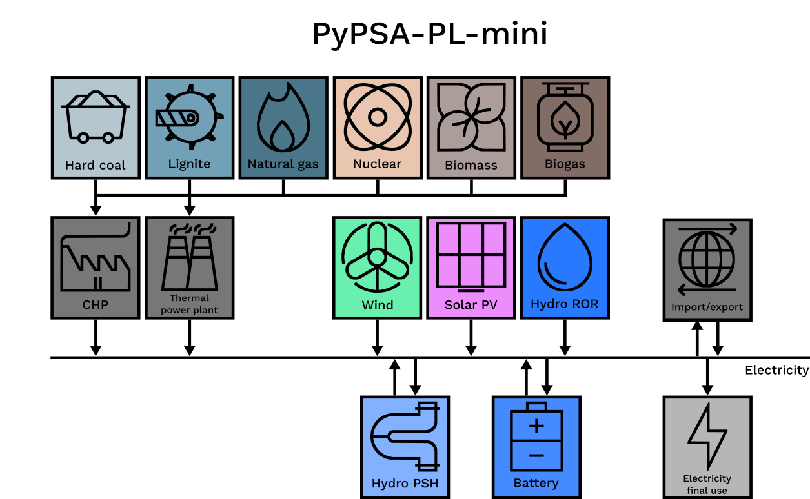

# PyPSA-PL-mini: simple optimisation model of the Polish energy system

## Introduction

PyPSA-PL-mini, a simplified version of [PyPSA-PL](https://github.com/instrat-pl/pypsa-pl/), is an implementation of the energy modelling framework [PyPSA](https://pypsa.readthedocs.io)
shipped with a use-ready dataset tailored for the Polish energy system. PyPSA-PL-mini is primarily intended for testing and educational purposes. Currently, PyPSA-PL-mini focuses solely on the power sector, and optimises the power supply throughout a selected four weeks of a year (one representative week per season, 672 hourly timesteps in total).

## Installation and usage

PyPSA-PL-mini can be deployed on the [Google Colab](https://colab.google/) platform. To do so, navigate to one of the PyPSA-PL-mini application notebooks in the [notebooks](notebooks) directory. In the notebook, click the "Open in Colab" banner and follow the instructions provided therein.

## Input data and assumptions

This table lists the main input data sources. More detailed source attribution can be found in the input spreadsheets themselves.

Input | Source
-- | ----
Technology and carrier definitions | [Kubiczek P. (2024). Technology and carrier definitions for PyPSA-PL model. Instrat.](https://docs.google.com/spreadsheets/d/1oM4T3LirR-XGO1fQ_KhiuQXW8t3I4AKj8q0n8P0s-aE)
Technological and cost assumptions | [Kubiczek P., Żelisko W. (2024). Technological and cost assumptions for PyPSA-PL model. Instrat.](https://docs.google.com/spreadsheets/d/1P-CGOaUUJt3J-6DfelAx5ilRSy0r2gCyJp_ZeHu1wbI)
Installed capacity assumptions | [Kubiczek P. (2024). Installed capacity assumptions for PyPSA-PL model. Instrat.](https://docs.google.com/spreadsheets/d/1fwosQK76x_FoXRSI6tphexjMchXSIX0NqAfHNCDI_BA)
Annual energy flow assumptions | [Kubiczek P. (2024). Annual energy flow assumptions for PyPSA-PL model. Instrat.](https://docs.google.com/spreadsheets/d/1OWm53wIPTVJf0PGUrUxhjpzfVJgyMhwdBLg5cuRzvZY)
Capacity utilisation assumptions | [Kubiczek P. (2024). Capacity utilisation assumptions for PyPSA-PL model. Instrat.](https://docs.google.com/spreadsheets/d/1OTZmzscUlB6uxuaWvN5Et1qpixFMubnh2m4-qbZD7rk)
Electricity final use time series | ENTSO-E. (2023). Total Load—Day Ahead / Actual. Transparency Platform. https://transparency.entsoe.eu/load-domain/r2/totalLoadR2/show
Wind and solar PV availability time series | De Felice, M. (2022). ENTSO-E Pan-European Climatic Database (PECD 2021.3) in Parquet format. Zenodo. https://doi.org/10.5281/zenodo.7224854    Gonzalez-Aparicio, I., Zucker, A., Careri, F., Monforti, F., Huld, T., Badger, J. (2021). EMHIRES dataset: Wind and solar power generation. Zenodo. https://doi.org/10.5281/zenodo.4803353
Temperature data used to infer heat demand time series | IMGW. (2023). Dane publiczne. Instytut Meteorologii i Gospodarki Wodnej. https://danepubliczne.imgw.pl/.

## License

The code is released under the [MIT license](LICENSE). The input and output data are released under the [CC BY 4.0 license](https://creativecommons.org/licenses/by/4.0/).

&copy; Instrat 2024

